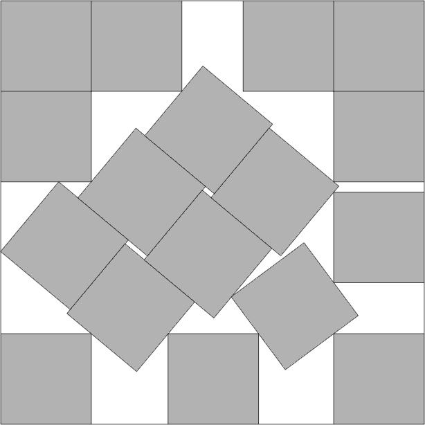
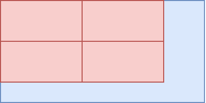
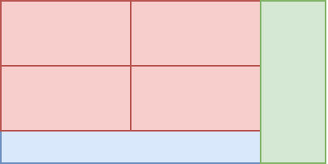
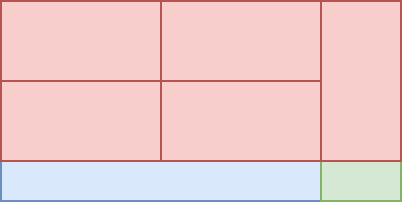
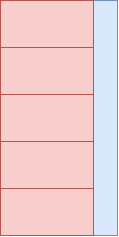

# Tarea Dev Junior - Ruuf

## 🎯 Objetivo

El objetivo de este ejercicio es poder entender tus habilidades como programador/a, la forma en que planteas un problema, cómo los resuelves y finalmente cómo comunicas tu forma de razonar y resultados.

## 🛠️ Problema

El problema a resolver consiste en encontrar la máxima cantidad de rectángulos de dimensiones "a" y "b" (paneles solares) que caben dentro de un rectángulo de dimensiones "x" e "y" (techo).

## 🚀 Cómo Ejecutar

```bash
python3 main.py
```

## 📝 Solución

Antes de comenzar con la descripción de la solución, tomé un supuesto importante para el desarrollo: **los paneles siempre estarán ortogonales al techo**. Esto significa que los lados de los paneles siempre estarán paralelos a los lados del techo. Decidí considerar esta restricción por dos motivos principales:

- Permitir que los paneles se puedan rotar en cualquier ángulo hace que el problema se vuelva extremadamente complejo, seguramente más allá del _scope_ de este ejercicio.
- Esta tarea se trata de la instalación de paneles solares en un techo, y nadie quiere que sus paneles solares se vean así:

  

  _Empaquetamiento **óptimo** de 17 cuadrados iguales en un cuadrado más grande._ :skull:

A continuación explico cómo funciona el algoritmo implementado.

1.  Se determina cuál es el lado más largo y más corto tanto para paneles como para el techo, mediante la función `determine_long_side`. Trabajar con estas variables facilita el trabajo siguiente.

2.  Se ejecuta la función recursiva `pack_panels_in_roof`, la que funciona de la siguiente forma:

    1.  Se calcula cuántos paneles caben horizontal y verticalmente dentro del techo mediante divisiones enteras. Es importante destacar que este cálculo se hace considerando lo siguiente:

        - El lado horizontal del techo siempre corresponde a su lado más largo.
        - El lado largo de los paneles es paralelo al lado largo del techo.

        Considerando esto, se puede obtener el número de paneles multiplicando ambos valores obtenidos. De esta forma, se puede comenzar a rellenar el techo:

        

        _Representación gráfica del paso 2.1. Techo en azul, paneles en rojo._

    2.  Se calcula el rectángulo vertical sobrante a lo largo del lado largo. En este ejemplo, este se vería así:

        

        _Representación gráfica del paso 2.2. Rectángulo sobrante en verde._

        Cabe destacar que sabemos que en el rectángulo horizontal sobrante (sección azul en la figura anterior) nunca cabrán más paneles, pues el lado más corto de los paneles siempre será mayor al lado más corto de este.

    3.  Si el rectángulo sobrante es muy pequeño para que quepa un panel en su interior, se termina la función de manera anticipada, retornando el total de paneles obtenido multiplicando los valores obtenidos en el paso 2.1.

    4.  Si el rectángulo sobrante es lo suficientemente grande, se ejecuta la función `pack_panels_in_roof` recursivamente sobre este. Esto se hace para "exprimir" el rectángulo (considerándolo como un "mini-techo") y colocar todos los paneles que quepan en él, esta vez rotados en 90°.

        Para hacer esto se considera como lado largo del "mini-techo" el lado corto del techo original, y como lado corto la distancia restante del lado largo del techo original.

        

        _Representación gráfica del paso 2.4._

        Finalmente, se almacena el número de paneles obtenido a partir de esta llamada recursiva.

    5.  Para terminar, se retorna el número total de paneles que caben en el techo, multiplicando los valores obtenidos en el paso 2.1 y sumando el valor obtenido en el paso anterior.

3.  Se vuelve a ejecutar la función `pack_panels_in_roof`, pero esta vez el techo se encuentra rotado en 90°, es decir, el lado largo de los paneles ahora es paralelo al lado corto del techo. Para lograr esto, se ejecuta la función de la misma forma anterior, pero con los argumentos de los lados del techo invertidos.

    Esto se hace porque existen casos en los que los paneles pueden encajar mejor si se ponen con esta orientación diferente, y en algunos casos se puede obtener un número de paneles totales diferente. Por ejemplo, en nuestro ejemplo obtendríamos la siguiente configuración:

    

    _Resultado del empaquetamiento con el techo rotado en 90°._

    Además de la diferencia ya mencionada, el resto del algoritmo funciona de la misma manera. Finalmente, se retorna el número de paneles totales que caben en el techo con esta configuración.

4.  Para terminar la ejecución, se compara el número de paneles que caben en el techo de acuerdo a ambas llamadas a `pack_panels_in_roof`, y se retorna el mayor de los valores.

---

## ✅ Casos de Prueba

Tu solución debe pasar los siguientes casos de prueba:

- Paneles 1x2 y techo 2x4 ⇒ Caben 4
- Paneles 1x2 y techo 3x5 ⇒ Caben 7
- Paneles 2x2 y techo 1x10 ⇒ Caben 0

---

## 💰 Bonus (Opcional)

Si completaste alguno de los ejercicios bonus, explica tu solución aquí:

### Bonus Implementado

_[Indica cuál bonus implementaste: Opción 1 (techo triangular) o Opción 2 (rectángulos superpuestos)]_

### Explicación del Bonus

_[Explica cómo adaptaste tu algoritmo para resolver el bonus]_

---

## 🤔 Supuestos y Decisiones

_[Si tuviste que tomar algún supuesto o decisión de diseño, explícalo aquí]_
